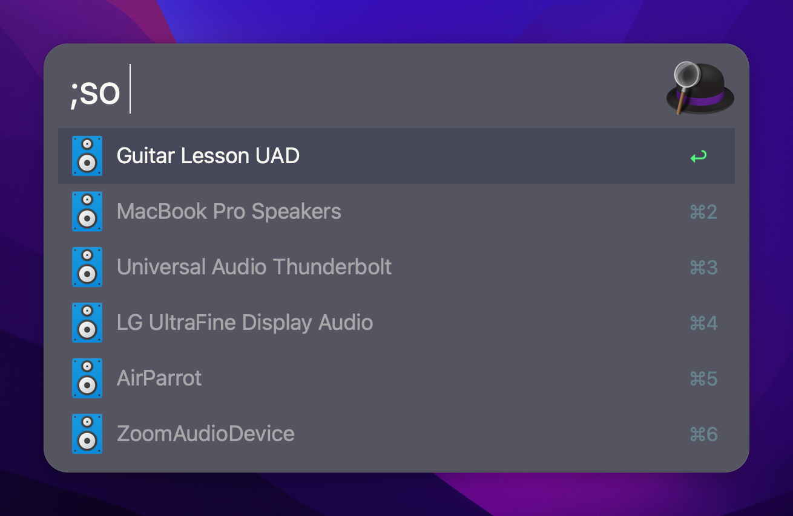
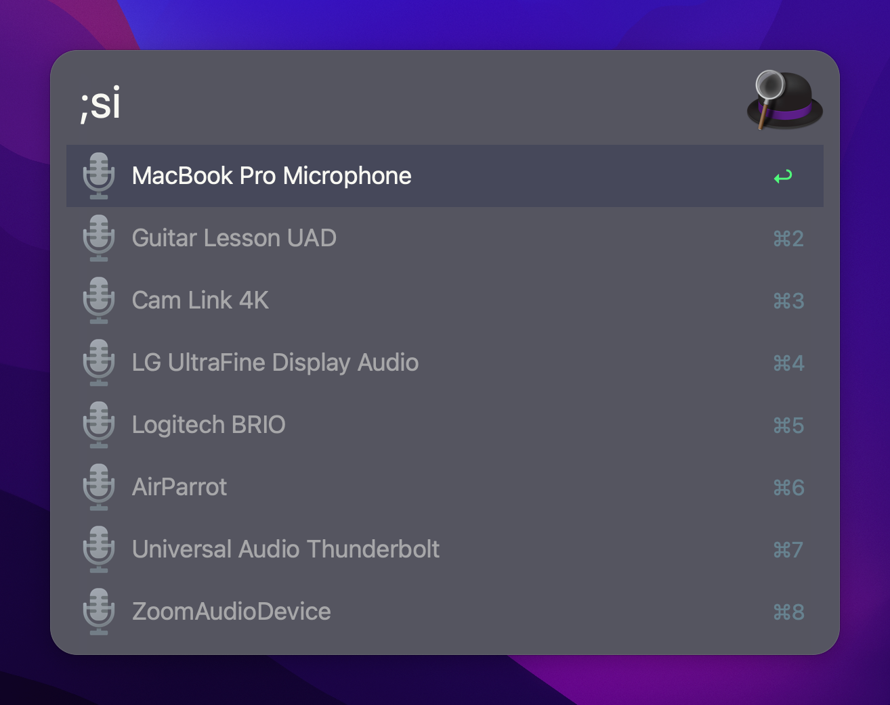

# SwitchAudio

Yet another audio input/output switching interface for SwitchAudioSource


## Prerequisites

You need to have both SwitchAudioSource and JQ installed on your mac. This is
most easily done via Homebrew:

```bash
brew install switchaudio-osx jq
```

## Installation

Download the workflow from GitHub and open it.

## Usage

In Alfred type

`;so` — to switch output device
`;si` — to switch input device

## Screenshots

Output selection


Input selection



